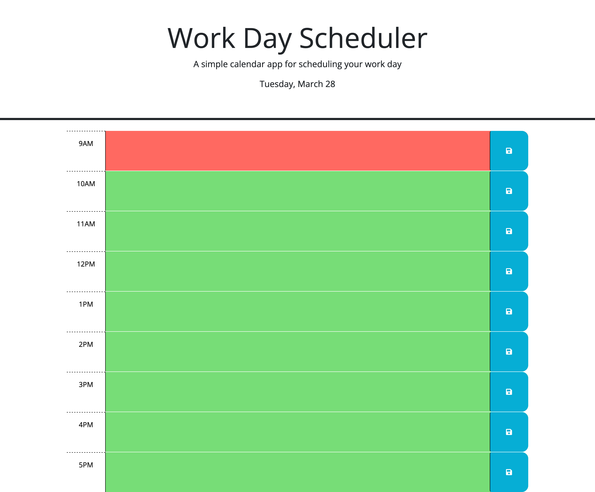

# Work Day Scheduler

## Description

The purpose of this project was to refactor a work day scheduler so that users can view their daily schedule during business hours from 9am to 5pm. Once on the page, users can see the day, month and date at the top. Below, the current hour shows up as red, the future hours show up as green and past hours show up as gray. Users are able to save information under each hour so they can go back to the page and see what's happening next in their day.

## Usage

Users can follow the link to the deployed webpage to access the work day scheduler. Click in the text area to fill in your daily schedule next to the appropriate hour and click the blue "save" button on the right.

### Webpage Link

https://brian-autieri.github.io/work-day-scheduler/

### Webpage Screenshot

## Credits

This challenge was completed in collaboration with the instructional staff, TA, tutor and classmates in the February 2023 UCLA Extension Coding Boot Camp.

## License

MIT License

Copyright (c) 2023 Brian Autieri

Permission is hereby granted, free of charge, to any person obtaining a copy of this software and associated documentation files (the "Software"), to deal in the Software without restriction, including without limitation the rights to use, copy, modify, merge, publish, distribute, sublicense, and/or sell copies of the Software, and to permit persons to whom the Software is furnished to do so, subject to the following conditions:

The above copyright notice and this permission notice shall be included in all copies or substantial portions of the Software.

THE SOFTWARE IS PROVIDED "AS IS", WITHOUT WARRANTY OF ANY KIND, EXPRESS OR IMPLIED, INCLUDING BUT NOT LIMITED TO THE WARRANTIES OF MERCHANTABILITY, FITNESS FOR A PARTICULAR PURPOSE AND NONINFRINGEMENT. IN NO EVENT SHALL THE AUTHORS OR COPYRIGHT HOLDERS BE LIABLE FOR ANY CLAIM, DAMAGES OR OTHER LIABILITY, WHETHER IN AN ACTION OF CONTRACT, TORT OR OTHERWISE, ARISING FROM, OUT OF OR IN CONNECTION WITH THE SOFTWARE OR THE USE OR OTHER DEALINGS IN THE SOFTWARE.
